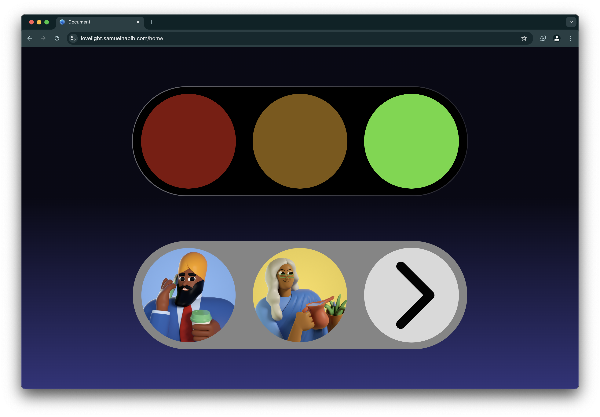
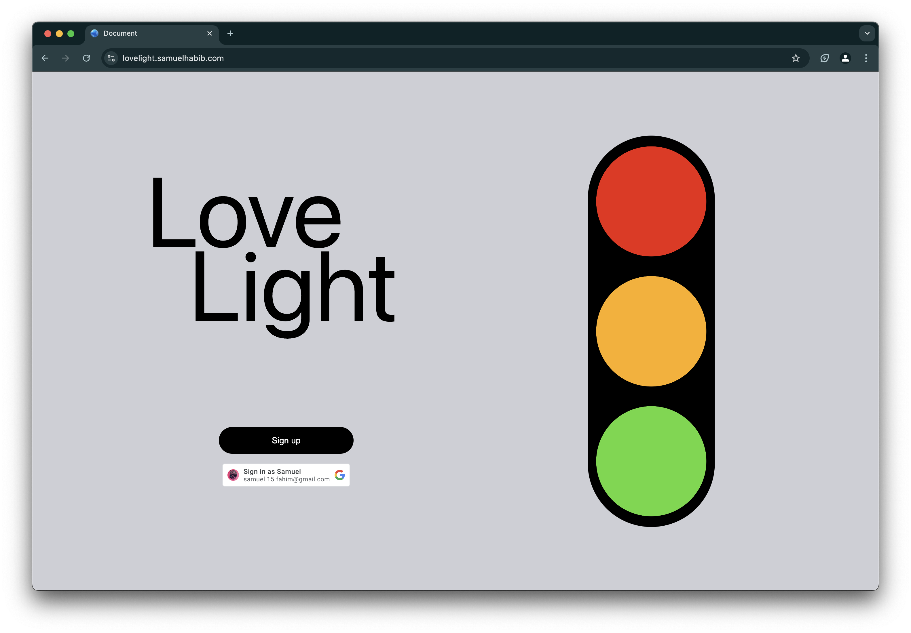

# Love Light

Love Light is a simple way to communicate your feelings to your partner. This website is a complete demonstration of the idea, although this would be a mobile app for convenience (coming soon). 






## Table of Contents

- [Installation](#installation)
- [Usage](#usage)
- [License](#license)

## Installation

To install the project, follow these steps:

1. Clone the repository:
    ```sh
    git clone https://github.com/yourusername/love_light.git
    ```
2. Navigate to the project directory:
    ```sh
    cd love_light
    ```
3. Install the dependencies:
    ```sh
    npm install
    ```

## Usage

To start using the project, run:
```sh
npm start
```

## License

This project is licensed under the MIT License. See the [LICENSE](LICENSE) file for more details.